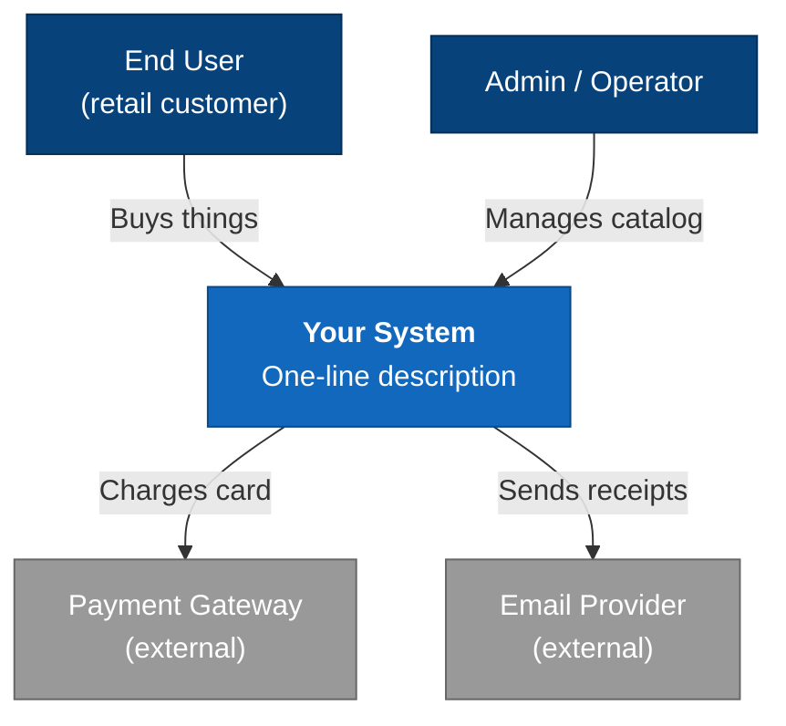
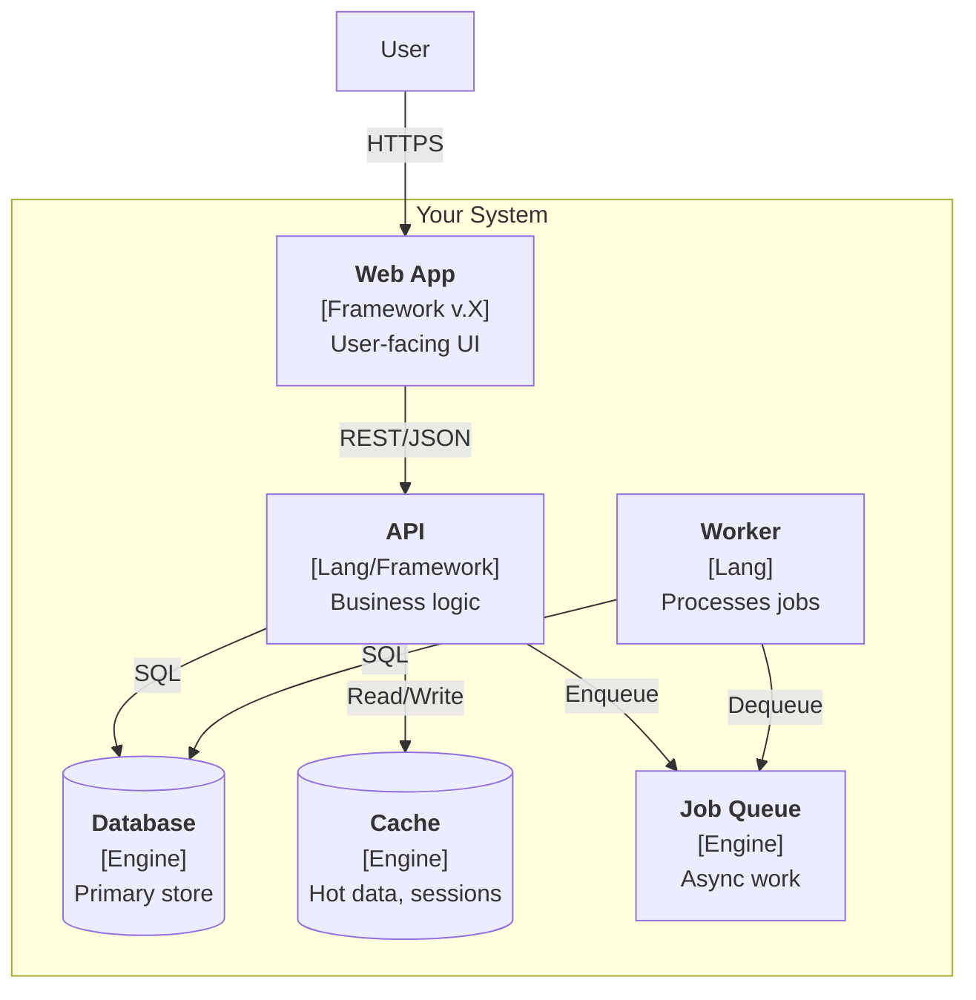
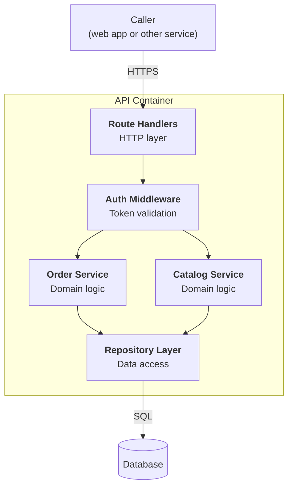

# C4 diagrams

C4 (Simon Brown) is the most practical notation for architectural communication: four zoom levels, each answering one question. Not UML — C4 is built for conversation, not formal verification.

## Pick the right level

| Level | Audience | Question | When to draw |
|---|---|---|---|
| **L1: System Context** | Non-technical, business, newcomers | "How does the system fit in the world?" | Project start, onboarding, exec discussion |
| **L2: Container** | Engineers inside the project | "What deployable units does the system consist of?" | Architectural overview, deployment discussion |
| **L3: Component** | Developers of a specific service | "How is one container internally organized?" | Designing a new service, refactor |
| **L4: Code** | Often nobody (auto-generated) | "Which classes / functions?" | Rarely drawn manually |

**Rule of thumb**: render only the level the conversation needs. Most architectural conversations live at L1 + L2. L3 only for the specific module under discussion. L4 — almost never by hand.

## Universal rules (apply to all levels)

- **Every arrow is labeled**: what flows (HTTP/JSON, gRPC, AMQP, ...) and why.
- **Every box names its technology**: `Vue 3 / Nuxt 4 / Pinia` or `PostgreSQL 16` in a sub-line.
- **Arrow direction = direction of dependency / request initiation**, not direction of data flow.
- **One level, one abstraction**. Don't mix containers and components on the same canvas.
- **A legend is mandatory** if you deviate from standard C4 colors.
- **No bidirectional arrows** — they almost always indicate the relationship is not thought through. One side initiates; draw that.

## L1: System Context — template

One box for your system. Around it, external actors (people, other systems). No internals.

## L2: Container — template

A container = independently deployable unit (SPA, API, DB, queue, worker). Always label the technology.

## L3: Component — template

Inside one container. Modules / layers, not individual files.

## Common mistakes

1. **Mixing levels** — classes appearing at L2, deployments at L3. Keep discipline.
2. **No technologies on boxes** — diagram becomes useless for technical conversation.
3. **Unlabeled arrows** — readers can't tell gRPC from AMQP.
4. **Too many boxes** — > 15 elements at L1/L2 means decompose, or show a partial view.
5. **External systems inside the trust boundary** — payment gateway is *external*, draw it that way.

## Tooling alternatives

| Tool | When |
|---|---|
| **Mermaid** | Default. Renders inline in GitHub/GitLab/Obsidian/Notion. Zero tooling. |
| **Structurizr DSL** | Long-term maintenance, generates all four levels from one description. Real tooling investment. |
| **PlantUML + C4-PlantUML** | When team already runs PlantUML infrastructure. |
| **draw.io / excalidraw** | One-off sketches, presentations. Not version-controllable as text. |

For most projects, Mermaid wins because it lives next to the code and renders everywhere.

## Step-by-step: bootstrapping a fresh project

1. **L1**: one box "my system" + 3–5 external actors. What does the system receive, what does it emit?
2. **L2**: decompose the box into 3–7 containers. Label technologies. Arrows are protocols.
3. **L3**: only if a specific container is complex enough to discuss internally.

If a dependency appears at L3 that doesn't exist at L2, your L2 is incomplete — fix it.

## Where diagrams live

- Save Mermaid sources as `.md` files in `docs/architecture/diagrams/`.
- Reference them from `ARCHITECTURE.md`.
- For binary diagrams (drawio, png), keep alongside an editable source — no images without sources.
